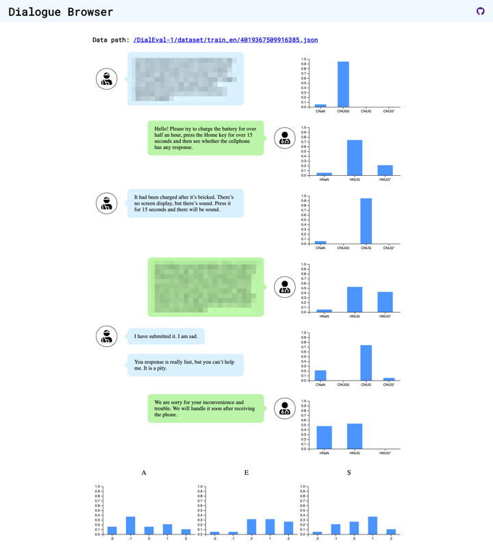

# dialogue-browser



## How to use

1. Prepare the DialEval-1 dataset.

2. Download

```
git clone https://github.com/sosuke-k/dialogue-browser
cd dialogue-browser
```

3. Copy the DialEval-1 dataset

```
cp -r path/to/DialEval-1 ./public/
```

4. Convert

```
python convert.py
```

5. Run

```
cd public
python -m http.server
```

6. Open a dialogue browser with a json path

e.g. http://localhost:8000/?jsonpath=/DialEval-1/dataset/train_en/4019367509916385.json


## Dependencies

- https://svelte.dev/
- https://d3js.org/

## Fonts / Icons

- https://fonts.google.com/
- https://fontawesome.com/

## Development (Customization)

Edit `src/components/*.svelte` files and run `npm run dev`.
